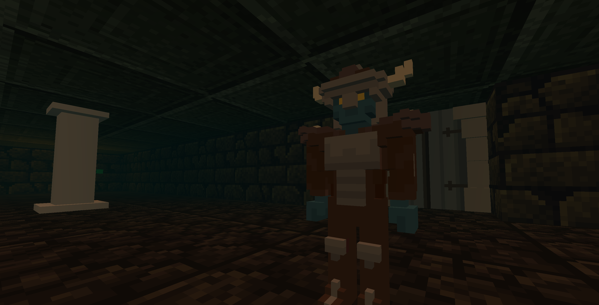

# Grid Dungeon RPG

A turn-based tactical dungeon crawler built with A-Frame, React, and Redux. Navigate a grid-based 3D dungeon, engage in strategic combat, level up your character, and defeat the boss!

## Design Documents

- **[GDD_LEAN_MVP.md](./GDD_LEAN_MVP.md)** - Complete Game Design Document for the lean MVP
- **[POST_MVP_ROADMAP.md](./POST_MVP_ROADMAP.md)** - Future features and comprehensive roadmap

## Development

See [TESTING.md](./TESTING.md) for test suite information.
